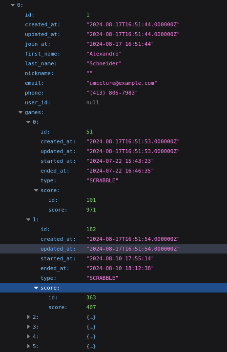

* Require PHP 8.2 or higher
* copy .env to .env.local and provide your variables for the database
>DB must be created

If you store your variables in .env.local not in .env and want to run any command which uses database you should specify local environment as in example below:
>php artisan migrate --env=local

Run:
> composer install

> npm install (node 18.^)

> npm run watch ( to start a dev server with UI)

Frontend is done with React JS.
I choose the more modern approach to separate the backend form the frontend and provide a data as json.

In some application there is still blade used, and it still has some usages but market is going towards decoupling frontend from backend which has many advantages.

For simplicity of that example used laravel ui 
- which allow me to mount react application to the empty blade template. However, in the production project is recommended to decouple frontend fully.

To populate database with random data:
>  php artisan db:seed --env=local

>**Populating database takes some time due to significant number of records. Should not be longer than 1min.**

**Notes:**

In simple scenario Player should be a User in the app however that approach is less flexible. I separated player from the user because:
- not every user of the app can/should be a player (in the future)
- app may provide additional functionality then just playing
 - making user a player we may finish with extra fields in user which will be irrelevant for some of them  and if user is not a player we just store null there which is against database RDM and optimisation.

Example response with Players, with their games, and relevant scores at given game.

